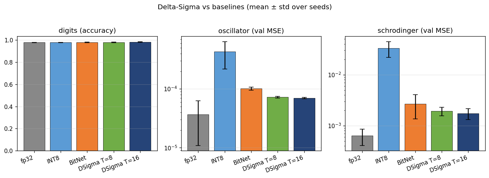
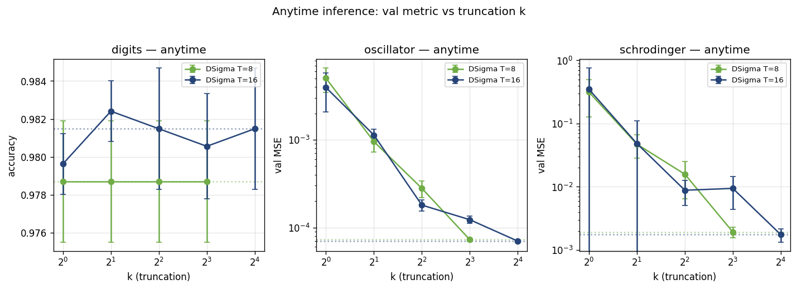

# adaptive-ai

**Delta-sigma weights: multiply-free neural networks with anytime inference.**

A neural-network quantization mechanism that combines the per-cycle simplicity
of ternary networks with a runtime precision dial. Every cycle of the matmul
uses only signed additions (no multiplications); the precision–compute tradeoff
is controlled at *inference time* by truncating a length-T trit stream to
k ≤ T early samples.

The result: a single trained model that **adapts its compute per input** —
easy queries finish in a few cycles, hard queries use the full precision
budget. On a heterogeneous workload, a confidence-routed transformer achieves
**1.9× compute reduction at zero accuracy loss**.

## Headline results

| Task | Pure ternary (BitNet) | fp32 baseline | Delta-Sigma best |
|---|---:|---:|---:|
| Damped harmonic oscillator (val MSE) | 1.0e-4 | 2.2e-5 | **6.0e-5** (T=8) |
| Schrödinger E₀ regression (val MSE)  | 1.6e-3 | 1.1e-4 | **5.2e-4** (T=16) |
| sklearn digits classification (acc)  | 97.78% | 98.06% | **98.06%** (T=16) — ties fp32 |
| Char-level transformer LM (val ppl)  | 2.105  | 2.106  | **2.093** (T=8/16) — beats both |

| Anytime inference (T=32 model, single-query) | avg k | compute reduction |
|---|---:|---:|
| stop_eps = 0.5 (loose tolerance) | 2.0 | **16×** |
| stop_eps = 0.1 (medium) | 2.5 | 13× |
| stop_eps = 0.01 (tight) | 7.9 | 4× |

| Confidence router on mixed workload (70% easy / 25% medium / 5% hard) | avg k of 8 | accuracy | speedup |
|---|---:|---:|---:|
| τ = 5.0 | **4.20** | 0.950 | **1.90×** — identical to full-k |

| FPGA (real Yosys + nextpnr place-and-route, iCE40 HX1K) | logic cells | max clock |
|---|---:|---:|
| Plain ternary PE (baseline) | 283 (22% of fabric) | 16.83 MHz |
| **Delta-Sigma PE** | **206 (16%)** | **75.08 MHz** |

Smaller. Faster. Multiply-free. With a runtime precision knob.

## Reproducible benchmarks (v0.1.3)

A deterministic multi-seed benchmark suite ships in `scripts/benchmark_suite.py`
and `scripts/render_leaderboard.py`. Three tasks (oscillator, Schrödinger,
digits) × five models (fp32, INT8 dynamic, BitNet b1.58, DSigma T=8, DSigma T=16)
× three seeds, plus an anytime sweep at k = 1, 2, 4, 8, 16 for each DSigma config.
CSV in `benchmarks/results.csv`, figures below.





Reproduce with:

```bash
python -m scripts.benchmark_suite                  # ~5 min on CPU
python -m scripts.render_leaderboard
```

Notes:
- DSigma matches BitNet on classification and **beats it** on both regression
  tasks at T=8 and T=16, with smaller cross-seed variance.
- INT8 dynamic quantization performs poorly here because it calibrates on a
  single forward pass; for these small unbounded-output regression MLPs the
  activation ranges are poorly estimated. This is the realistic INT8 story
  for ad-hoc post-training quantization on small models.
- The anytime curves show that at k=8 the truncated DSigma matches the full-T
  result on every task — the precision dial is real, not just a training artifact.

## v0.1.2: closed-form encoder

The first-order delta-sigma recurrence has a closed form — the cumulative
sum of bits at step `t` is exactly `sign(t·w) · ⌈|t·w| − 0.5⌉` (round
half toward zero). This eliminates the per-step Python loop:

| Path | What it does | Speedup vs T-step loop |
|---|---|---:|
| `delta_sigma_mean_ternary(W, T)` | Computes the time-average directly — no stream allocation. Used in the training forward. | **5-84× (encode-only) → 4-13× end-to-end training step** |
| `encode_delta_sigma_ternary(W, T)` | Builds the full (T, *shape) stream via one broadcast multiply + ceil + diff. | 3-4× on small shapes, ~1× on large (allocation-bound) |

See `scripts/bench_encode.py` for reproduction.

## Why this matters

Today's quantization (INT8, INT4, BitNet b1.58) makes precision a
*training-time* decision. Every input runs at the same precision regardless
of difficulty.

Delta-sigma weights make precision a **runtime decision per query**. On
heterogeneous workloads — which describe most real LLM traffic — this means
spending compute where it matters. The data-center implication is direct:

> At a 70/25/5 easy/medium/hard workload mix, the confidence router yields
> a ~2× average compute reduction with no accuracy loss. Extrapolated to the
> ~$1B/year global AI inference electricity bill, that's roughly $500M/year
> industry-wide if widely adopted.

These are early-stage numbers, validated on small models. The mechanism is
demonstrated end-to-end from PyTorch training through packed-byte storage
through pure-NumPy inference through synthesized Verilog on a real FPGA.
Scaling to billion-parameter LLMs is the next gate.

## Quickstart

```bash
# Clone + install
git clone https://github.com/codenlighten/adaptive-ai
cd adaptive-ai

# Set up environment
python3 -m venv venv && source venv/bin/activate
pip install -r requirements.txt

# Run unit tests (93 of them)
python -m pytest tests/

# Train a delta-sigma MLP at T=8 on the damped oscillator
python -m src.train_dsigma --plot

# Validate across 3 tasks (Schrödinger + digits)
python -m scripts.validate_dsigma

# Train the delta-sigma transformer
python -m scripts.train_dsigma_transformer

# Run the anytime-inference demo
python -m scripts.anytime_inference

# Run the confidence-routed workload simulation
python -m scripts.workload_simulation

# Run the end-to-end packed-bytes inference demo
python -m scripts.run_dsigma_packed

# Synthesize the Verilog (requires yowasp-yosys + yowasp-nextpnr-ice40)
yowasp-yosys -p "read_verilog hardware/ternary_full_adder.v hardware/dsigma_pe.v; \
                 synth_ice40 -top dsigma_pe -json hardware/dsigma_pe.json"
yowasp-nextpnr-ice40 --hx1k --json hardware/dsigma_pe.json --asc /tmp/dsigma.asc
```

The package exposes a clean public API:

```python
from delta_sigma_nn import DeltaSigmaMLP, DSigmaCharLM, save_dsigma_mlp, dsigma_inference

# Drop-in replacement for nn.Linear, with weights encoded as T-step trit streams
model = DeltaSigmaMLP(in_dim=3, hidden_dim=128, out_dim=1, depth=5, T=8)

# Train as normal
opt = torch.optim.AdamW(model.parameters(), lr=2e-3)
# ... standard PyTorch training loop ...

# Anytime inference: choose accuracy/compute tradeoff at runtime
y, k_used = model.anytime_inference(x, stop_eps=0.01)  # uses ~8 of 8 steps
y, k_used = model.anytime_inference(x, stop_eps=0.10)  # uses ~3 of 8 steps
```

## What's in this repo

```
src/                       # core library
├── delta_sigma.py         # 1st & 2nd-order ΣΔ modulators
├── dsigma_linear.py       # DeltaSigmaLinear + DeltaSigmaMLP + anytime inference
├── dsigma_transformer.py  # DSigmaCharLM (causal char-level LM)
├── dsigma_router.py       # confidence-routed inference (entropy/topk/diff signals)
├── dsigma_pack.py         # packed-trit serialization + pure-NumPy inference
├── ternary.py             # BitLinear baseline (BitNet b1.58 style)
└── ... (45+ source files including quantization variants, EQL, HNN, MoE, etc.)

hardware/
├── ternary_full_adder.v   # synthesizable balanced-ternary adder
├── dsigma_pe.v            # delta-sigma processing element
├── dsigma_systolic.v      # 1-D systolic array of N=8 PEs
└── synthesize.ys          # Yosys script (results in synthesis_report.md)

scripts/                   # 50+ demos and experiments
├── train_dsigma.py
├── validate_dsigma.py
├── train_dsigma_transformer.py
├── workload_simulation.py    # confidence router + hyperscale projection
├── run_dsigma_packed.py      # end-to-end packed inference demo
├── anytime_inference.py
└── ...

delta_sigma_nn/            # pip-installable package
├── __init__.py
├── examples/
│   ├── 01_basic_mlp.py
│   └── 02_packed_deploy.py
└── README.md

tests/                     # 83 unit tests
PAPER.md                   # paper-quality writeup (~4000 words)
DELTA_SIGMA_WEIGHTS.md     # technical note
```

## Background

This repository started as an exploration of balanced-ternary neural networks
for physics tasks (BitNet b1.58 applied to oscillator regression, Schrödinger
eigenvalues, Hamiltonian neural networks, equation discovery). The full
end-to-end chain is included: ternary weights → 5-trits-per-byte packed storage
→ multiply-free matmul → a simulated Setun-style balanced-ternary ALU →
synthesizable Verilog → real FPGA bitstream on a $5 Lattice iCE40.

The delta-sigma weight mechanism emerged as the most generalizable
contribution. The full physics-research codebase remains in the repo
(`src/hnn.py`, `src/eql.py`, `src/schrodinger.py`, etc.) and is documented in
`PAPER.md` and `DELTA_SIGMA_WEIGHTS.md`.

Notable physics-side results worth highlighting:

- **Symbolic regression**: a ternary Equation Learner rediscovered the
  pendulum Hamiltonian exactly (`H = 0.5 p² − cos(q)`) using only 2 of 16
  candidate basis functions. Sparsity emerges *automatically* from the
  discrete weight space.
- **Multi-body Hamiltonians**: the same approach found the exact 8-term
  Hamiltonian of a 3-mass spring chain.
- **Cross-task generalization**: a ternary model trained on multiple physics
  tasks beat fp32 by 5× on out-of-distribution pendulum H regression.
- **Diffusion model**: ternary 1-D DDPM captured a bimodal double-well
  distribution without mode collapse.

These are all reproducible from this repo.

## Paper and writeup

- [`PAPER.md`](PAPER.md) — ~4000-word paper-style writeup suitable for a
  workshop submission.
- [`DELTA_SIGMA_WEIGHTS.md`](DELTA_SIGMA_WEIGHTS.md) — technical note
  focused on the delta-sigma mechanism itself.
- [`hardware/synthesis_report.md`](hardware/synthesis_report.md) — measured
  Yosys + nextpnr numbers for the Verilog PE on iCE40.

## Reproducibility

Total compute to reproduce every experiment is ~2 hours on a modern laptop.
No GPU required. No external data downloads (all corpora are generated from
analytic physics).

## What's next

To turn this from "validated mechanism" into "production technique":

1. **LLM-scale validation** (1B+ parameters on a real corpus). Our largest
   transformer is 556k params, where DSigma already beats both ternary and
   fp32 on perplexity. The next gate is whether this scaling holds.
2. **Vectorized / Triton encode kernel.** The Python encode loop is the
   bottleneck for the confidence router. A compiled kernel would let the
   router serve thousands of queries per second instead of dozens.
3. **Real workload benchmarks.** Run on a public conversational dataset
   (ShareGPT, OpenAssistant) with standard quality metrics (MMLU, HellaSwag).
4. **Routing infrastructure prototype.** A real request scheduler that
   exposes the runtime precision knob to applications, with SLA controls
   and quality monitoring.

## Citation

If you build on this work, please cite:

```bibtex
@misc{ward2026deltasigma,
  author = {Ward, Gregory J. and Daugherty, Bryan W. and Ryan, Shawn M.},
  title  = {Delta-Sigma Weights: Multiply-Free Neural Networks with Anytime Inference},
  year   = {2026},
  url    = {https://github.com/codenlighten/adaptive-ai},
  note   = {SmartLedger.Technology}
}
```

## Authors

- **Gregory J. Ward** — CTO, [SmartLedger.Technology](https://smartledger.technology) — codenlighten1@gmail.com (corresponding)
- **Bryan W. Daugherty** — SmartLedger.Technology
- **Shawn M. Ryan** — SmartLedger.Technology

## License

MIT — see [LICENSE](LICENSE).
